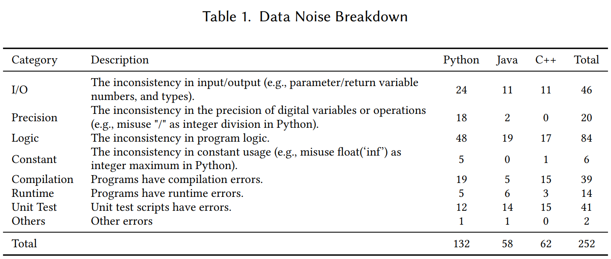

## Exploring and Unleashing the Power of Large Language Models in Automated Code Translation

### Preparation
````commandline
jdk17
javafx-sdk-20 refer to https://openjfx.io/openjfx-docs/#introduction
Stack BackTrace for C++: https://github.com/NEWPLAN/newplan_toolkit/backtrace
EMMA Coverage Tool: https://emma.sourceforge.net/
transformers == 4.30.2
torch == 1.12.1
````

### Attachments
- Please find the data noise breakdown here: 
- Please find the tmp.java file here: [tmp.pdf](figures%2Ftmp.pdf).  
- Please find the statistical test results here: [statistical test.pdf](figures%2Fstatistical%20test.pdf).
- Please find the OJ experimental results in the folder ```oj_samples```, which is reported in the threats to validity section.  

### Cleaned Dataset
- ```./cleaned_data/testable_samples.jsonl```: cleaned dataset used in this work, including parallel functions of Java, Python, and C++.  
- ```./cleaned_data/transcoder_evaluation_gfg```: test cases associated with the cleaned dataset.

### Quick Start 

- Test Case Generation Phase
  1. generate inputs with LLMs  (taking GPT3.5 as an example)
  ```commandline
    python gpt3_5.py --dst_lang ${dst_lang} --obj 0 --k ${test_case_num} --k ${sample_k}
    ``` 
  2. collect test cases
  ```commandline
    python process_valid_inputs.py --model ${model_name} --dst_lang ${dst_lang}
  ```

- Translation Augmentation Phase
  1. translation augmentation (taking GPT3.5 as an example)
  ```commandline
    python gpt3_5.py --src_lang ${src_lang} --dst_lang ${dst_lang} --obj 3 --k ${sample_k} --test_case_num ${test_case_num}  
  ```
  2. post-process translated programs.
  ```commandline
    python process_translation.py --src_lang ${src_lang} --dst_lang ${dst_lang} --suffix ${suffix}
  ```
  3. translation evaluation
  ```commandline
    python fetch_feedbacks.py --model ${model_name} --src_lang ${src_lang} --dst_lang ${dst_lang} --test_case_num ${test_case_num} round ${round}
  ```

- Translation Repair Phase  
  1. error info analysis
  ```commandline
    python process_feedbacks.py --src_lang ${src_lang} --dst_lang ${dst_lang} --round ${round} --test_case_num ${test_case_num}  
  ```
  2. program repair
  ```commandline
    python gpt3_5.py --src_lang ${src_lang} --dst_lang ${dst_lang} --obj 4 --k ${sample_k} --test_case_num ${test_case_num} 
  ```
  3. post-process repaired programs.
  ```commandline
   python process_translation.py --src_lang ${src_lang} --dst_lang ${dst_lang} --suffix ${suffix}
  ```

- Evaluation
  1. evaluation for computational accuracy
  ````commandline
    python evaluation_CA.py --model ${model_name} --src_lang ${src_lang} --dst_lang ${dst_lang} --k ${CA@k} --timeout ${timeout} --suffix ${suffix}
    ````
  2. evaluation for exact match accuracy
  ````commandline
    python evaluation_EM.py --model ${model_name} --src_lang ${src_lang} --dst_lang ${dst_lang} --suffix ${suffix}
    ````
